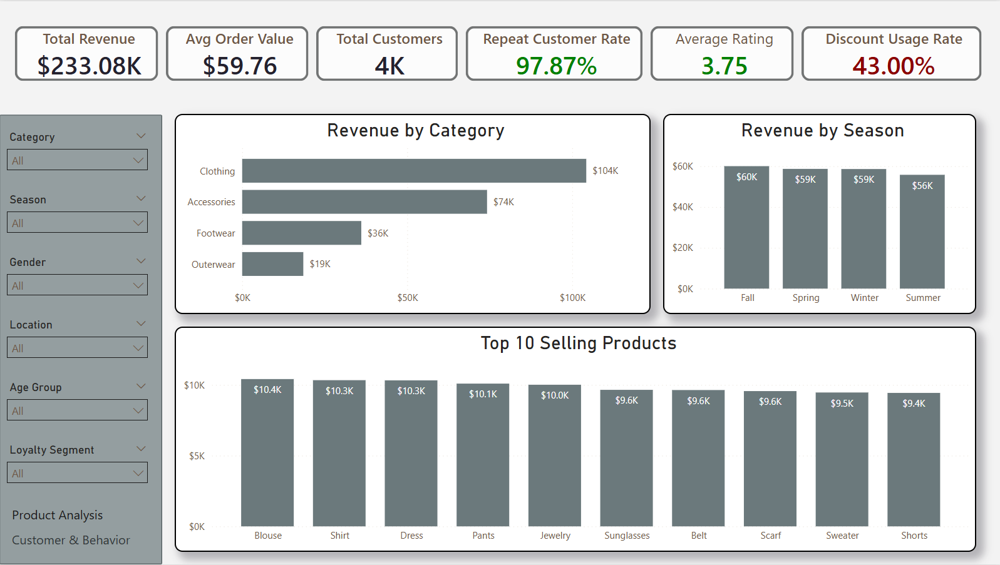
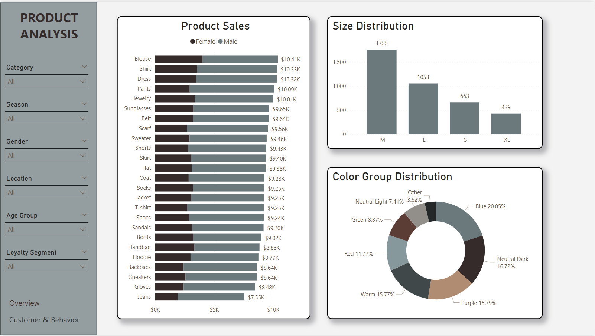
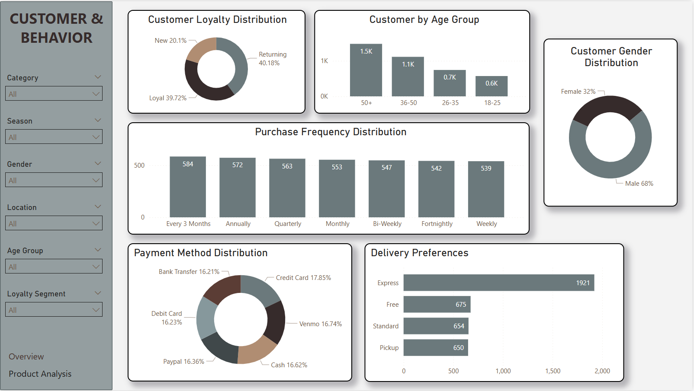

# 🛍️ Shopping Trends Dashboard (Power BI)

## 📊 Project Overview

This project presents an interactive Power BI dashboard built using a retail shopping trends dataset. The goal is to analyze customer purchasing behavior, product performance, and key business drivers to support data-driven decision-making.

The dashboard is divided into three main sections:

* **Overview**
* **Product Analysis**
* **Customer & Behavior Insights**

---

## 📁 Project Structure

```text
customer-shopping-trends/
│
├── raw/
│   └── customer-shopping-trends.csv
│
├── dashboard/
│   └── shopping-trends_dashboard.pbix
│
├── images/
│   ├── shopping-cb.png
│   ├── shopping-overview.png
│   └── shopping-product.png
│
└── README.md
```

---

## 🧾 Dataset Description

Source: Raw `.csv` file

The dataset contains transactional and customer-level information, including:

* Customer demographics (Age, Gender, Location)
* Purchase details (Item Purchased, Category, Purchase Amount)
* Behavioral data (Purchase Frequency, Previous Purchases)
* Customer feedback (Review Rating)
* Operational data (Shipping Type, Payment Method)
* Marketing indicators (Discount Applied, Subscription Status)


Original Data Source: [Customer Shopping Trends Dataset](https://www.kaggle.com/datasets/iamsouravbanerjee/customer-shopping-trends-dataset)

---

## 🛠️ Tools & Technologies

* Power BI (Data modeling, DAX, dashboard design)
* Power Query (Data cleaning and transformation)

---

## 📌 Dashboard Features

### 📍 Page 1 — Overview

* Total Revenue, Average Order Value, Total Customers
* Repeat Customer Rate, Average Rating, Discount Usage Rate
* Revenue by Category
* Revenue by Season
* Top 10 Selling Products

---

### 📍 Page 2 — Product Analysis

* Product Sales (Revenue by Item Purchased)
* Size Distribution
* Color Group Distribution

---

### 📍 Page 3 — Customer & Behavior

* Customer Distribution by Age Group
* Customer Loyalty Segmentation
* Customer Gender Distribution
* Purchase Frequency Distribution
* Payment Method Distribution
* Delivery Preferences

---

## 🔍 Key Insights

### 🛍️ Product Performance

* Clothing is the highest-performing category.
* A small group of products (e.g., blouse, shirt, dress) contributes a large portion of total revenue.

### 📅 Seasonal Trends

* Sales peak during the **Fall season**, indicating strong seasonal demand.

### 👥 Customer Behavior

* Most customers fall within the **50+ age group**.
* Purchases are typically made **every few months**, indicating low purchase frequency.

### 🔁 Customer Loyalty

* There is a mix of new and returning customers, but retention can still be improved.

### 🚚 Delivery & Payment Preferences

* **Express shipping** is the most preferred delivery option.
* Customers favor **credit cards and digital payment methods**.

### 🎯 Marketing Opportunity

* A large portion of customers do not use discounts or subscriptions, suggesting untapped marketing potential.

---

## 💡 Business Recommendations

* **Focus on Top Products:** Increase inventory for high-performing items such as blouse, shirt, and dress.
* **Leverage Seasonality:** Prepare inventory and marketing campaigns ahead of peak seasons (especially Fall).
* **Increase Purchase Frequency:** Introduce loyalty programs, reminders, or subscription-based offers.
* **Optimize Shipping Strategy:** Offer free shipping thresholds to encourage higher spending.
* **Enhance Marketing Efforts:** Promote discounts and encourage customer subscriptions to boost engagement.

---


## 📷 Dashboard Preview







---

## 🚀 How to Use

1. Download the `.pbix` file from this repository
2. Open using Power BI Desktop
3. Interact with slicers and visuals to explore insights

---

## 📌 Future Improvements

* Enhance dashboard visuals by familiarizing with more dax formula for formatting
* Automate data refresh pipeline
* Add forecasting and trend projection models
  
---

## 👤 Author

**Kim Singson**


Aspiring Data Analyst

---

Created as part of a data analytics portfolio project to demonstrate skills in:

* Data cleaning
* Data modeling
* Dashboard design
* Business insight generation

---
